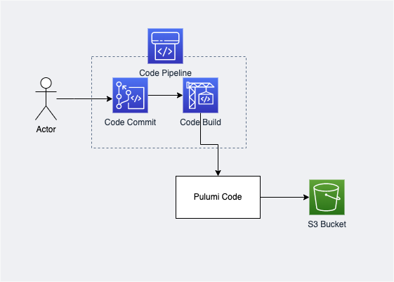

# **PULUMI CI CD**
### **Design Architecture**

> In this code we will create s3 with pulumi using codepipeline ci cd
### **Requirement**
1. [AWS CLI installed](https://docs.aws.amazon.com/cli/latest/userguide/getting-started-install.html)
2. [Configure AWS CLI](https://docs.aws.amazon.com/cli/latest/userguide/cli-configure-quickstart.html#cli-configure-quickstart-config)
3. [Pulumi installed](https://www.pulumi.com/docs/get-started/install/)
4. [Pulumi logged in](https://www.pulumi.com/docs/reference/cli/pulumi_login/)
### **How To**
1. Clone repository 
```
git clone https://github.com/ludesdeveloper/pulumi-ci-cd.git
```
2. Change directory
```
cd pulumi-ci-cd
```
### **Create CodeCommit, CodeBuild, And CodePipeline**
1. Change directory
```
cd create-codepipeline
```
2. Execute initialization script
```
./init.sh
```
3. Script will ask for region, please type and hit enter
4. Script will ask for pulumi token, please provide [Access Token](https://www.pulumi.com/docs/intro/console/accounts/#creating-access-tokens) 
5. Execute pulumi up
```
pulumi up
```
### **Push Pulumi Code to Repository**
> This code will create new s3 bucket if CI CD success, before you follow these steps below, please remove .git folder in root folder
1. Change directory to **push-to-codecommit**
2. Execute initialization script
```
./init.sh
```
> Type dev for stack name, to easily follow along
3. Add remote repo to git
```
./git_remote_init.sh
```
4. Push code to repo
```
git push origin master
```
### **Clean Up**
1. Make sure you are in push-to-codecommit folder
2. Type command below
```
pulumi destroy --yes
```
3. Remove stack created in pulumi app
```
pulumi stack rm dev
```
4. Next we will destroy our Code Pipeline, make sure you are in create-codepipeline folder
```
pulumi destroy --yes
```
5. remove stack created in pulumi app
```
pulumi stack rm dev
```
